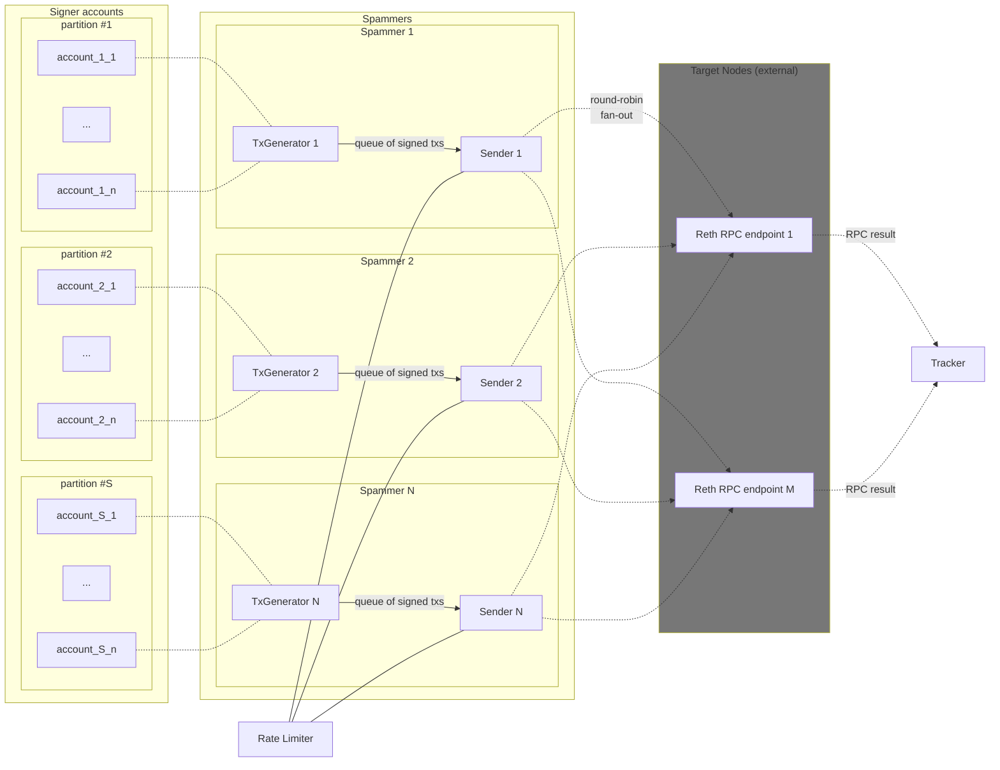
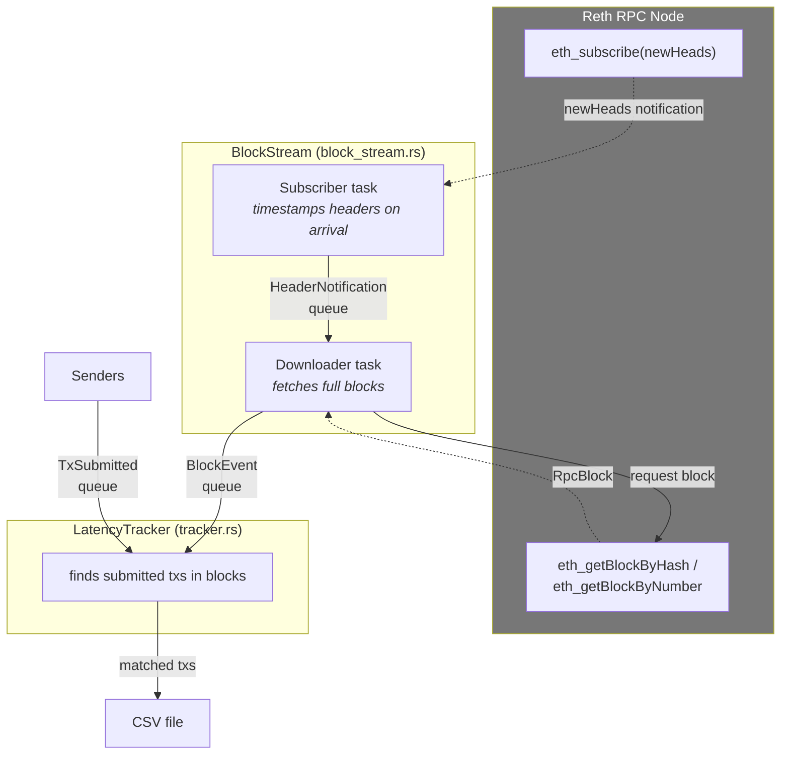

# Spammer

Transaction load generator: create, sign, and send transactions to multiple nodes

**Table of contents**

- [Architecture overview](#architecture-overview)
- [CLI usage](#cli-usage)
  - [`spammer ws`](#spammer-ws)
  - [`spammer nodes`](#spammer-nodes)
- [Main parameters](#main-parameters)
  - [GasGuzzler workload](#gasguzzler-workload)
- [Transaction Latency Tracking](#transaction-latency-tracking)
  - [What it measures](#what-it-measures)
  - [Enabling latency tracking](#enabling-latency-tracking)
  - [How it works](#how-it-works)
  - [Latency tracker architecture](#latency-tracker-architecture)
  - [CSV output format](#csv-output-format)
  - [Analyzing results](#analyzing-results)

## Architecture overview

The `spammer` command generates and sends transactions to Reth RPC endpoints with
multiple __Spammers__ running in parallel.



**Spammers**:
- A Spammer is composed of a _Transaction Generator_ and a _Transaction
  Sender_, and it targets a subset of Reth RPC endpoints. In this
  implementation we use WebSocket connections, which are much faster than HTTP
  connections.

**Transaction Generators**:
- A Transaction Generator repeteadly creates a transaction, picks one of its
  _signer accounts_ in round-robin fashion, and sends the signed transaction to
  its associated Sender via a _buffered channel_.
- The buffered channel will be important to have signed transactions ready in
  the channel once the sender starts. Before start running the senders, we wait
  a few seconds to buffer transactions. If senders start with empty channels, it
  may take a few seconds to reach the desired load rate.

**Signer accounts**:
- The genesis file contains a number of _pre-funded accounts_ that the
  generators use to sign the generated transactions. By default, the genesis
  file is created on `setup` with 100 accounts. It is possible to generate more
  accounts with `quake setup --num-extra-accounts <NUM_EXTRA_ACCOUNTS>`.
- Each generator is assigned a subset of the signer accounts. The whole range of
  signer accounts is partitioned between generators. There are two modes to
  partition the account space: linear (default) and exponential.
  - In the _linear_ mode the space is divided equally between generators.
  - In the _exponential_ mode, each generator takes half of the unassigned
  space until there's no more space unassigned. In this way, the generator with
  half of the accounts will take more time to reuse the same account to generate
  transactions, thus reducing the probability of having nonce conflicts for
  those accounts. On the other side, generators handling a small range of
  accounts will reuse those accounts very frequently, thus reaching higher nonce
  values for those accounts.
- Generators may optionally pre-initialise their set of accounts by creating all
  signer accounts on start up and querying all target nodes for the last nonce
  used by that account. Otherwise the accounts are initialised on demand, but
  this may slow down the generation process. Finding the latest nonce is also
  expensive, and it is possible to disable it, and start all accounts from nonce
  0.

**Transaction Senders**:
- A sender continously picks any available transaction in the channel and
  fan-outs it to one of the target nodes. For each transaction, it chooses a
  target node in round-robin fashion.
- All senders are controlled by a shared _Rate Limiter_. Before taking a
  transaction from the channel, a sender consults the Rate Limiter if it can
  send a transaction. The Rate Limiter either returns:
  - "yes, send the transaction", or
  - "wait until the next second, the quota for this second has been reached", or
  - "no, the maximum number of transactions has been reached".
- A sender may also stop if the time is up, when there's a maximum time set up
  for the load event.
- All RPC response results are forwarded to the _Result Tracker_.

**Rate Limiter**:
- The Rate Limiter controls transaction throughput (transactions per second) and
  total number of sent transactions over all generators.

**Result Tracker**:
- Monitors RPC request outcomes and provides real-time statistics on successful
  and failed transactions, with updates printed every second.

## CLI usage

The CLI separates how targets are selected from the rest of the spammer configuration
using subcommands.

### `spammer ws`

Target nodes by directly specifying their WebSocket endpoints (as `IP:PORT` or `ws://...`).
If no endpoints are provided, it defaults to `127.0.0.1:8546`.

Examples:

```bash
spammer ws 127.0.0.1:8546
spammer ws ws://127.0.0.1:8546 ws://127.0.0.1:9546
```

### `spammer nodes`

Target nodes by name using a nodes metadata file (for example a Quake-generated
`.quake/<testnet-name>/nodes.json`).

- If no node names are provided, all nodes from the file are targeted.
- `--nodes-path` is required.

Examples:

```bash
spammer nodes --nodes-path ./.quake/5nodes/nodes.json
spammer nodes --nodes-path ./.quake/5nodes/nodes.json validator1 validator2
```

## Main parameters

The following parameters are shared across both `spammer ws` and `spammer nodes`.

```
  -g, --num-generators <NUM_GENERATORS>
          Number of transaction generators to run in parallel [default: 1]
  -a, --max-num-accounts <MAX_NUM_ACCOUNTS>
          Maximum number of genesis accounts used to sign transactions [default: 1000]
  -m, --partition-mode <PARTITION_MODE>
          How to partition the account space among generators (linear or exponential) [default: linear]
  -n, --num-txs <NUM_TXS>
          Maximum total number of transactions to send (0 for no limit) [default: 0]
  -r, --rate <RATE>
          Number of transactions to send per second [default: 1000]
  -t, --time <TIME>
          Maximum time in seconds to send transactions (0 for no limit) [default: 0]
  -x, --max-txs-per-account <MAX_TXS_PER_ACCOUNT>
          Maximum number of transactions to send per account (0 for no limit) [default: 0]
  -i, --preinit-accounts
          Pre-initialize accounts with their signing keys and latest nonces (default is to lazily initialize each account)
  -l, --query-latest-nonce
          Whether to query nodes for the latest nonce of each account before sending the first transaction (may choke RPC endpoints) or start from nonce=0 (faster)
  -p, --show-pool-status
          Output the status of all Reth tx-pools (number of pending and queued transactions) [aliases: --pools]
  -w, --wait-response
          Wait for the response from Reth after sending a transaction
```

### GasGuzzler workload

To generate compute-heavy transactions instead of simple transfers, enable the GasGuzzler workload:

```
      --guzzler-fn-weights <GUZZLER_FN_WEIGHTS>
          Comma-separated list of function=weight@arg entries.
          Available functions: hash-loop, storage-write, storage-read, guzzle, guzzle2.
          Format: hash-loop=70@2000,storage-write=30@600,storage-read=0,guzzle=0,guzzle2=0
          Only enabled functions (weight > 0) need the @arg suffix.
          If total weight is 0 (or flag omitted), EIP-1559 transfer transactions are used.
```

What does each `weight@arg` entry mean?

- `weight` controls how frequently the function is sampled relative to others.
- `arg` is the function argument:
  - `hash-loop`, `storage-write`, `storage-read`: `iterations`
  - `guzzle`, `guzzle2`: `gasRemaining`
- For disabled functions, you can use `function=0` (no `@arg` needed).
- See the contract implementation and docs in [GasGuzzler.sol](../../contracts/src/mocks/GasGuzzler.sol).
  It includes CPU-heavy and storage-heavy paths.

How to choose `arg` values

- `arg` controls the workload intensity per transaction call. Higher values mean more gas consumed per tx.
- Start with one enabled function, e.g. `hash-loop=100@500`, then increase `arg` gradually (1000, 2000, ...).
- The spammer randomizes +/-20% around each selected function's `arg` to avoid perfectly uniform work per tx.
- Gas is estimated per call and padded; if an estimate fails, a generous fallback is used.

Notes:

- The `GasGuzzler` contract is pre-deployed at localdev genesis. All generators call this shared instance directly.
- The default (`hash-loop=0,storage-write=0,storage-read=0,guzzle=0,guzzle2=0`) disables GasGuzzler.
- Gas is estimated per call; if an estimate fails, a generous fallback limit is used.

Examples:

```bash
# WebSocket endpoints directly
spammer ws ws://127.0.0.1:8546 --guzzler-fn-weights hash-loop=100@2000,storage-write=0,storage-read=0,guzzle=0,guzzle2=0 -r 20 -t 30

# Nodes by name from a Quake-generated nodes.json
spammer nodes --nodes-path ./.quake/5nodes/nodes.json --guzzler-fn-weights hash-loop=0,storage-write=100@500,storage-read=0,guzzle=0,guzzle2=0 -r 50 -t 60

# Mixed workload: mostly storage-write with some hash-loop and storage-read
spammer nodes --nodes-path ./.quake/5nodes/nodes.json --guzzler-fn-weights hash-loop=20@2000,storage-write=70@700,storage-read=10@500,guzzle=0,guzzle2=0 -r 40 -t 60
```

### Transaction Type Mix

Use `--mix` to blend transaction types with relative weights:

```
      --mix <MIX>
          Weighted transaction type mix.
          Format: transfer=70,erc20=20,guzzler=10
          Omitted types default to weight 0 (disabled).
          When --mix is omitted, behavior depends on --guzzler-fn-weights:
            if guzzler functions are enabled: 100% guzzler;
            otherwise: 100% transfer.
```

Available transaction types:

- `transfer` — native USDC value transfer (EIP-1559)
- `erc20` — ERC-20 call on the TestToken contract (function selected by `--erc20-fn-weights`, defaults to `transfer`)
- `guzzler` — GasGuzzler contract call (function selected by `--guzzler-fn-weights`)

When `--mix` includes `guzzler`, you must also provide `--guzzler-fn-weights` with at
least one enabled function.

`--erc20-fn-weights` is optional; when omitted, ERC-20 defaults to 100% `transfer`.

Examples:

```bash
# 100% ERC-20 transfers (default function)
spammer ws ws://127.0.0.1:8546 --mix erc20=100 -r 100 -t 30

# 70% native transfers, 30% ERC-20
spammer ws ws://127.0.0.1:8546 --mix transfer=70,erc20=30 -r 100 -t 30

# All three types: 50% transfer, 20% ERC-20, 30% GasGuzzler (hashLoop)
spammer ws ws://127.0.0.1:8546 --mix transfer=50,erc20=20,guzzler=30 --guzzler-fn-weights hash-loop=100@2000 -r 100 -t 30
```

### ERC-20 Function Mix

Use `--erc20-fn-weights` to blend ERC-20 function calls with relative weights:

```
      --erc20-fn-weights <ERC20_FN_WEIGHTS>
          Weighted function mix for ERC-20 calls.
          Format: transfer=70,approve=20,transfer-from=10
          Omitted functions default to weight 0 (disabled).
          When omitted (all weights 0), ERC-20 uses 100% transfer.
```

Available functions:

- `transfer` — ERC-20 `transfer(to, amount)`: moves tokens from the signer to the recipient
- `approve` — ERC-20 `approve(spender, amount)`: authorizes the recipient as a spender
- `transfer-from` — ERC-20 `transferFrom(from, to, amount)`: moves tokens on behalf of another account; may revert if no prior approval exists (this is expected)

Notes:

- No `@arg` suffix is needed (unlike `--guzzler-fn-weights`); ERC-20 functions have fixed behavior.
- When `--erc20-fn-weights` is omitted, ERC-20 defaults to 100% `transfer` for backward compatibility.
- `transferFrom` calls may revert if no prior approval exists, which is expected. Over sustained runs, `approve` calls naturally build up allowances so some `transferFrom` calls succeed organically.

Examples:

```bash
# ERC-20 with mixed functions: 60% transfer, 30% approve, 10% transferFrom
spammer ws ws://127.0.0.1:8546 --mix erc20=100 --erc20-fn-weights transfer=60,approve=30,transfer-from=10 -r 100 -t 30

# Stress approve-heavy workload
spammer ws ws://127.0.0.1:8546 --mix erc20=100 --erc20-fn-weights approve=100 -r 100 -t 30

# Mixed workload: native transfers plus diverse ERC-20 functions
spammer ws ws://127.0.0.1:8546 --mix transfer=50,erc20=50 --erc20-fn-weights transfer=70,approve=30 -r 100 -t 30
```

## Transaction Latency Tracking

Measure how long transactions take from submission to when a client observes them in
a finalized block.

### What it measures

The latency tracker records the time between:

1. **Submission**: when the spammer sends the transaction to the RPC endpoint of a node
2. **Finalization**: the block in which the the transaction was included is known to be finalized, via a RPC subscription
observes.

This measures end-to-end transaction latency as experienced by a client.
Notice that it does not include the delay for downloading the finalized block,
as the finalization time is computed when the associated block header is observed.

### Enabling latency tracking

Add the `--tx-latency` flag to any spammer command:

```bash
# With WebSocket endpoints
spammer ws ws://127.0.0.1:8546 --tx-latency -r 100 -t 30

# With nodes from a Quake-generated file
spammer nodes --nodes-path ./.quake/5nodes/nodes.json --tx-latency -r 1000 -t 60

# Write the CSV to a specific directory
spammer ws ws://127.0.0.1:8546 --tx-latency --csv-dir /tmp/results -r 100 -t 30
```

### How it works

The tracker runs as a separate task alongside the transaction senders:

1. The sender of a transaction computes its hash locally (`keccak256` of the
   EIP-2718 encoded bytes), bounds it to the submission timestamp, and forwards
   this information to the `LatencyTracker` via a channel.
2. A `BlockStream` subscribes to `eth_subscribe("newHeads")` for push-based
   new block header notifications. When a new header arrives the wall-clock time is
   recorded, and forwarded to the block downloader via a channel.
3. The `BlockStream` consumes the new block header events and downloads the
   associated full blocks via the `eth_getBlockByHash` endpoint. The full block and
   the header metadata, specially the receive time, are sent to the `LatencyTracker`
   via a channel.
3. The `LatencyTracker` receives block events, scans each block's transaction
   list, and matches hashes against submitted transactions.
4. Matched transactions are written to a CSV file with their latency data.
5. When all senders finish, the tracker drains any remaining in-flight block
   events (with a short grace period) and exits. Transactions that were never
   finalized are reported in the summary log.

Output is written to a timestamped file: `tx_latency_<yyyymmdd>_<hhmmss>.csv`
(e.g., `tx_latency_20260310_151123.csv`).

By default the file is created in the current directory. Use `--csv-dir` to
write it elsewhere. When invoked via `quake load`, the CSV is automatically
placed under `.quake/results/<testnet-name>/`.

**Note on `--wait-response`**: With the `-w` / `--wait-response` flag, the
spammer waits for the node's response and only records transactions that the
node accepted. Without this flag, the node's response is not checked, so
rejected transactions may still be tracked (appearing as unmatched at the end).
For more accurate latency data, use `--wait-response`, though it will slow down
execution.

### Latency tracker architecture

The latency tracking system lives in `src/latency/` and is split into five
files:

```
src/latency/
├── mod.rs            Module declarations and re-exports
├── block_stream.rs   BlockStream producer-consumer for block discovery
├── csv.rs            CSV row and block metadata types
├── timestamp.rs      Timestamp formatting and hex parsing helpers
└── tracker.rs        LatencyTracker, submission types, eviction logic
```

**BlockStream** (`block_stream.rs`) uses a producer-consumer model:



- The **producer** subscribes to `newHeads` via WebSocket and timestamps each
  header immediately on arrival. This ensures accurate receive timestamps
  independent of block fetch latency. It reconnects with exponential backoff
  on connection errors.

- The **consumer** fetches the full block for each header using
  `eth_getBlockByHash`, with retries on null responses. Catch-up
  and gap-fill scans use `eth_getBlockByNumber` instead. On its
  first notification it performs a catch-up scan from the starting
  block height (captured at tracker init) to cover blocks produced
  before the subscription started. It also detects height gaps
  after producer reconnects and fills them with range scans.

- The **LatencyTracker** (`tracker.rs`) multiplexes over
  transaction submissions from senders and block events from BlockStream.
  Before scanning each block it drains any buffered submissions to avoid
  missing transactions that were submitted before the block arrived. Stale
  unfinalized transactions are evicted every 20 blocks (~10 seconds at 500ms
  block times) to bound memory usage.

### CSV output format

Each row represents one finalized transaction:

| Column | Description |
|--------|-------------|
| `tx_hash` | Transaction hash (0x-prefixed) |
| `submitted_at` | When the spammer submitted the transaction (RFC 3339) |
| `finalized_observed_at` | When the tracker observed finalization (RFC 3339) |
| `included_block_number` | Block number containing the transaction |
| `included_block_hash` | Hash of the block (0x-prefixed) |
| `included_block_timestamp` | Block timestamp from the chain (RFC 3339) |

**Note**: `finalized_observed_at` is the wall-clock time when the tracker
"saw" the block, not the actual finalization time. The latter would be the
`included_block_timestamp`.

### Analyzing results

Use the Python script `scripts/tx_latency_report.py` to query and analyze the
CSV data. The script loads the CSV into a SQLite database for fast queries.

#### Basic usage

```bash
# Full report over all data
python3 scripts/tx_latency_report.py --csv tx-latency-1234567890.csv

# Check data bounds
python3 scripts/tx_latency_report.py --csv tx-latency-1234567890.csv timestamps
python3 scripts/tx_latency_report.py --csv tx-latency-1234567890.csv blocks
```

#### Subcommands

| Subcommand | Description |
|------------|-------------|
| `report` | Compute latency statistics (default if no subcommand given) |
| `timestamps` | Print min and max submission timestamps |
| `blocks` | Print min and max block numbers |

#### Filtering (report subcommand)

Filter the data to analyze specific time ranges or blocks:

```bash
# From a specific time onward
python3 scripts/tx_latency_report.py --csv data.csv report --from-time 2026-02-03T10:00:00Z

# From a specific block onward
python3 scripts/tx_latency_report.py --csv data.csv report --from-block 1000

# Between two timestamps
python3 scripts/tx_latency_report.py --csv data.csv report \
  --between-time 2026-02-03T10:00:00Z 2026-02-03T10:05:00Z

# Between two blocks
python3 scripts/tx_latency_report.py --csv data.csv report --between-block 1000 2000

# Single block
python3 scripts/tx_latency_report.py --csv data.csv report --block 1500
```

Time values accept Unix epoch milliseconds or ISO 8601 format. If no timezone
is specified, UTC is assumed.

#### Example output

```
No. of txs=58432
Min latency=312ms
Max latency=2847ms
Avg latency=892ms
P50 latency=845ms
P90 latency=1256ms
P95 latency=1534ms
P99 latency=1891ms
```

- **P50**: 50% of transactions finalized within this time (median)
- **P90**: 90% of transactions finalized within this time
- **P95**: 95% of transactions finalized within this time
- **P99**: 99% of transactions finalized within this time

#### Additional options

```bash
# Use a custom SQLite database path (default: <csv_path>.sqlite)
python3 scripts/tx_latency_report.py --csv data.csv --db /tmp/latency.sqlite

# Force reload data from CSV into SQLite
python3 scripts/tx_latency_report.py --csv data.csv --rebuild-db
```
