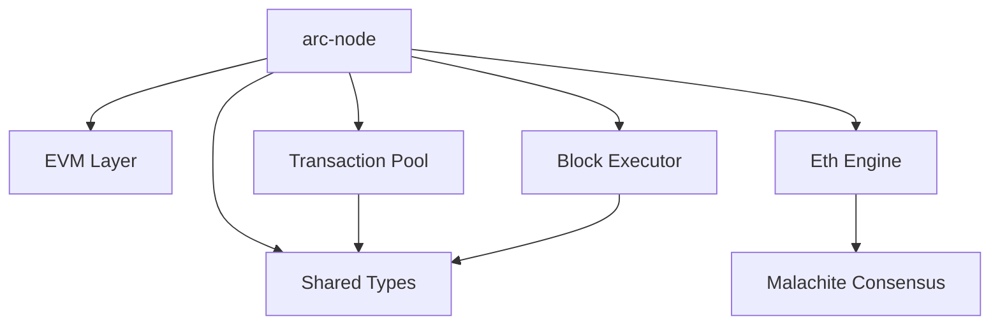
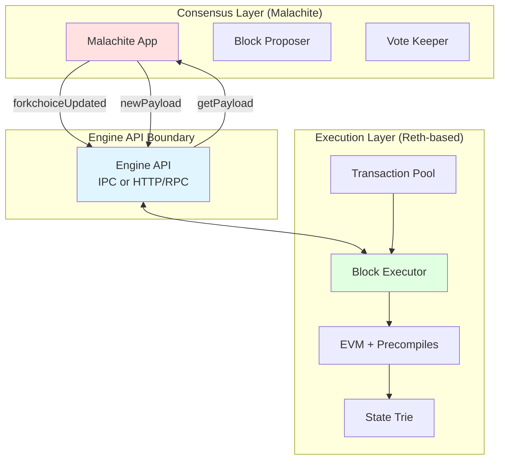
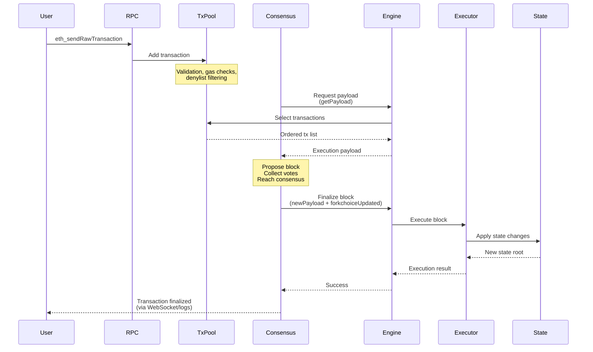
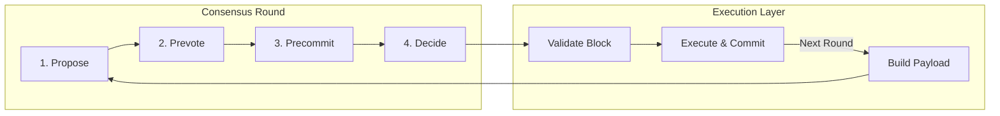
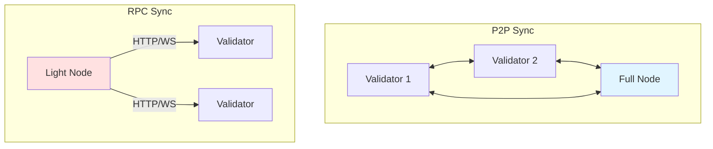

# Architecture

This document provides a comprehensive overview of the Arc Network node architecture and codebase organization.

## Table of Contents

- [Overview](#overview)
- [Core Crates](#core-crates)
- [Node Crate Deep Dive](#node-crate-deep-dive)
- [Extension Points](#extension-points)

## Overview

## Architectural Layers

Arc Network follows a clean separation between consensus and execution layers, communicating via the Ethereum Engine API. This modular design allows each layer to evolve independently while maintaining a stable interface.

### Consensus-Execution Boundary

The two layers communicate through the [Engine API](https://github.com/ethereum/execution-apis/blob/main/src/engine/), a standard interface originally designed for proof-of-stake Ethereum. Key implementation:

- **Engine API Client**: [crates/eth-engine/src/engine.rs](../crates/eth-engine/src/engine.rs)
- **Malachite Integration**: [crates/malachite-app/src/app.rs](../crates/malachite-app/src/app.rs)

## Transaction Lifecycle

Understanding how a transaction flows through the system illustrates how consensus and execution layers interact:

### Key Stages

1. **Transaction Submission** ([crates/node/src/txpool/pool.rs](../crates/node/src/txpool/pool.rs))
   - Validates transaction format and signature
   - Checks denylist for blocked addresses
   - Adds to mempool if valid

2. **Block Proposal** ([crates/malachite-app/src/app.rs](../crates/malachite-app/src/app.rs))
   - Consensus layer requests payload via `engine_getPayload`
   - Execution layer builds block with selected transactions
   - Proposer signs and broadcasts proposal

3. **Consensus** (Malachite core)
   - Validators vote on proposed block
   - Once ⅔+ votes collected, block is decided
   - Certificate generated with validator signatures

4. **Execution** ([crates/node/src/executor.rs](../crates/node/src/executor.rs))
   - Consensus sends `engine_newPayload` + `engine_forkchoiceUpdated`
   - Block executor runs transactions through EVM
   - State trie updated with new balances, storage
   - Custom precompiles handle native features

5. **Finalization**
   - State root committed to database
   - Transaction receipts generated
   - Events emitted for subscribers

## Block Production Flow

The consensus layer implements a variant of Tendermint with three voting phases per round. The execution layer is consulted at the beginning (payload building) and end (validation & execution) of each round.

## Synchronization Modes

Arc nodes support two synchronization strategies:

### P2P Sync (Default)
Traditional gossip-based synchronization where nodes:
- Exchange blocks via libp2p
- Participate in consensus as validators or full nodes
- Maintain peer connections for liveness

**Implementation**: [crates/malachite-app/src/node.rs](../crates/malachite-app/src/node.rs) (lines 340-380)

### RPC Sync Mode
Alternative for lightweight full nodes that:
- Fetch blocks via HTTP from trusted RPC endpoints
- Subscribe to block headers via WebSocket
- Don't participate in P2P networking or consensus

**Implementation**: [crates/malachite-app/src/rpc_sync/](../crates/malachite-app/src/rpc_sync/)

## Node Crate Deep Dive

The `node/` crate is the heart of the execution layer. Here's a detailed breakdown:

### EVM Customization

The EVM layer (`src/evm.rs`) allows for:

- Custom base fee calculation logic
- Integration of custom precompiles
- EVM configuration overrides

See [Configuration Guide](CONFIGURATION.md#custom-base-fee-calculation) for customization details.

### Precompiles

Custom precompiles are defined in `src/precompiles/`:

- **Native Coin Authority** (`0x80`) - Authority operations for native coin
- **Native Coin Control** (`0x81`) - Control operations for native coin
- **System Accounting** (`0x82`) - System-level accounting operations
- **PQ Signature Verify** (`0x83`) - Post-quantum signature verification

See [Configuration Guide](CONFIGURATION.md#adding-more-precompiles) for details on adding new precompiles.

### Transaction Pool

The custom transaction pool (`src/txpool/`) provides:

- Configurable pool parameters
- Custom validation logic
- Transaction denylist support

See [Configuration Guide](CONFIGURATION.md#transaction-denylist-configuration) for details.

### Payload Building

The payload builder (`src/payload.rs`) handles:

- Block construction
- Transaction selection and ordering
- Gas limit management
- Emergency denylist on panic

## Data Flow

```mermaid
graph LR
    TxSubmit[Transaction Submitted]
    TxPool[Transaction Pool]
    Validator[Pool Validator]
    Denylist[Denylist Check]
    Payload[Payload Builder]
    Executor[Block Executor]
    EVM[EVM Execution]
    State[State Update]

    TxSubmit --> Validator
    Validator --> Denylist
    Denylist --> TxPool
    TxPool --> Payload
    Payload --> Executor
    Executor --> EVM
    EVM --> State
```

## Further Reading

- [Configuration Guide](CONFIGURATION.md) - Detailed configuration options
- [Contributing Guide](../CONTRIBUTING.md) - Development workflow and guidelines
- [ADRs](adr/README.md) - Architecture Decision Records
